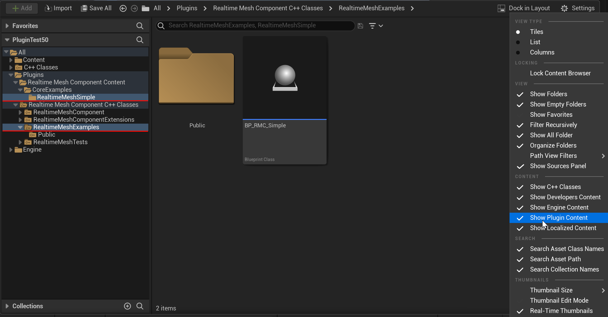

RMC ships its examples as C++ actors rather than as a separate content pack, so they are available the moment the plugin is switched on. There is nothing to import.

## The RealtimeMeshExamples module

Most of the examples live in the `RealtimeMeshExamples` C++ module. That covers the Simple, Procedural, and Dynamic mesh types, plus the generator and spatial streaming actors.

Every example derives from `ARealtimeMeshExampleActor` and builds a real mesh as soon as you place it in a level, so dropping one into a test map is enough to see it render. The [Examples tour](../../examples/) lists all of them.

## Nanite examples

The Nanite examples live in their own `RealtimeMeshNaniteExamples` module. This one is an **Editor** module, meaning it loads in the editor but not in a packaged game. It is there for exploring the Nanite build pipeline while you work, not for shipping.

## Making plugin content visible

Some plugin assets, such as the materials the examples use, only show up in the Content Browser once plugin content is visible. If you cannot find them, turn it on with `Settings -> Enable Plugin Content` in the Content Browser.

