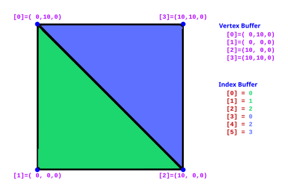

Mesh data in RMC is stored as an indexed triangle list. That means two buffers working together.

**The vertex buffer** holds all the unique points of your mesh. Ideally there are no duplicates, though note that a vertex is only "the same" if *every* one of its attributes matches. Two points in the same position but with different normals are two different vertices.

Each vertex can carry:

1. **Position**: where the vertex sits in object space, as X, Y, Z.
2. **Normal**: the direction the surface faces at this vertex. For smooth shading, neighbouring triangles share a common normal. Also called Tangent-Z.
3. **Tangent**: the "forward" direction along the surface, used for normal mapping. Also called Tangent-X.
4. **UV coordinates, 1 to 8 channels**: also called texture coordinates. These say which part of a texture lands on this vertex. You can also use them to smuggle arbitrary data into a material and read it back with a TextureCoordinate node.
5. **Color**: vertex color. Again, useful either as an actual color or as a way to pass data to the material.

**The index buffer** says which vertices make up which triangles. It is a flat list of integers, and every group of three describes one triangle.

The picture below shows two triangles sharing an edge. That takes 6 entries in the index buffer but only 4 vertices, because the two along the shared edge get reused.

## Winding order

The order you list a triangle's three indices in matters, because of an optimisation called backface culling. The renderer skips triangles that face away from the camera, and it works out which way a triangle faces from the order of its points.

Unreal uses counter-clockwise culling. If a triangle's points read clockwise on screen, it will not be drawn.

So: **index your vertices counter-clockwise** as seen from the side you want to be visible. If a mesh comes out invisible when you know the geometry is right, this is almost always why.

## Doing more with index buffers

Once you are comfortable with the basics, index buffers combined with RMC's buffer sets and sections let you do some useful tricks:

* Keep one detailed index buffer for the visible mesh and a simpler one for shadows. Shadows only care about position, so you can weld far more vertices together. RMC exposes this directly as the `DepthOnlyTriangles` stream.
* Build several different index buffers over the same vertices and switch between which one renders.

## Poly groups

Poly groups let you split one mesh into pieces that render separately, usually so each piece can have its own material.

You add an extra index stream with one entry per triangle, holding that triangle's group number. RMC then turns each group into its own section automatically, so a single set of buffers can render as a car body, its windows, and its tyres, each with a different material.

One requirement: RMC assumes the triangles of a group are all next to each other in the buffer. If you build them in a random order, there are utilities to sort them afterwards.

`ARealtimeMeshExample_Simple_HelloTriangle` (`Source/RealtimeMeshExamples/Private/Simple/RealtimeMeshExample_Simple_HelloTriangle.cpp`) shows this in miniature, tagging a triangle and its reversed copy into two different groups.

## Further reading

* Triangle primitives, if you want the graphics-API level detail:

    <https://www.khronos.org/opengl/wiki/Primitive#Triangle_primitives>

* Winding order and face culling:

    <https://www.khronos.org/opengl/wiki/Face_Culling>
